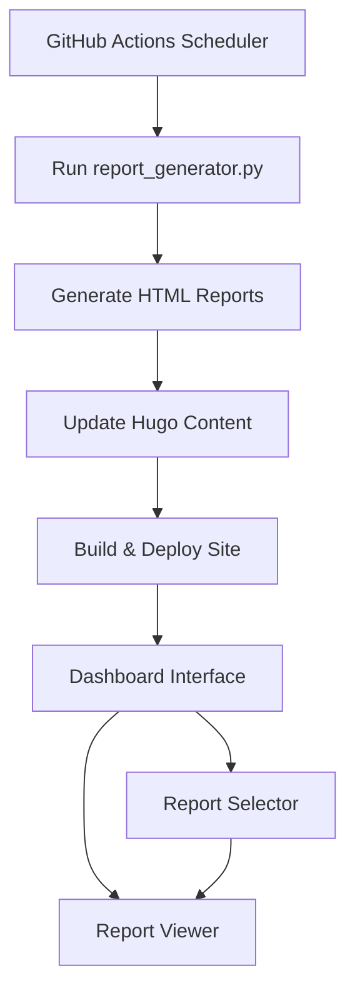
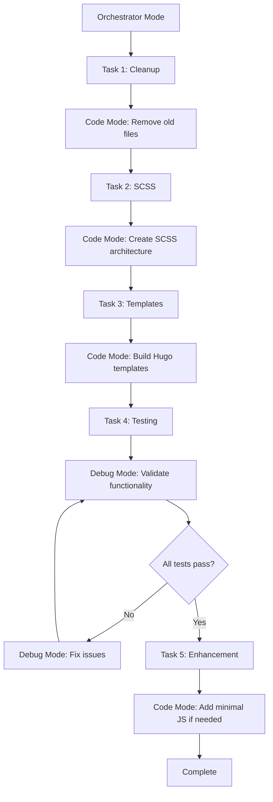

# Stock Analysis Dashboard Implementation Plan

## Overview

Create a dashboard-style interface for stock analysis reports with a report selector on the left and report viewer on the right, integrated with automated report generation and deployment.

## Architecture



## Phase 1: Clean Hugo Dashboard Architecture

### 1.1 Dashboard Layout Structure

**Main Dashboard Page:** `content/StockReport/_index.md`
- Full-width dashboard layout using CSS Grid
- Left sidebar: Report selector with Hugo-powered search
- Right panel: Report viewer (iframe/embedded HTML)
- Fully responsive design with mobile-first approach

### 1.2 Clean File Structure (Remove & Rebuild)

**Files to Remove:**
- ❌ `static/css/stock-dashboard.css` - Replace with SCSS
- ❌ `static/js/stock-dashboard.js` - Minimize or eliminate JS
- ❌ `layouts/StockReport/single.html` - Rebuild with clean architecture

**New Files to Create:**
- ✅ `assets/scss/stock-dashboard.scss` - Modern SCSS with CSS Grid
- ✅ `layouts/StockReport/single.html` - Clean Hugo template with `readDir`
- ✅ `layouts/partials/stock-reports/sidebar.html` - Report selector partial
- ✅ `layouts/partials/stock-reports/viewer.html` - Report viewer partial
- ✅ `static/js/minimal-dashboard.js` - Minimal JS for essential interactions only

### 1.3 Dashboard Features

**Report Selector (Left Panel):**
- Search box for filtering reports by stock symbol
- List of available reports with metadata
- Date stamps and generation status
- Quick filters (e.g., by strategy type)

**Report Viewer (Right Panel):**
- Iframe container for HTML reports
- Loading states and error handling
- Fullscreen toggle option
- Report navigation controls

## Phase 2: Pure Hugo Integration (No JavaScript Dependencies)

### 2.1 Server-Side Report Processing

**Hugo-Only Approach:**
- Use Hugo's `readDir` function to scan `static/reports/` directory
- Generate search functionality using Hugo templates and CSS
- URL-based report selection (no JavaScript required)
- Progressive enhancement with minimal JavaScript

**Hugo Template Implementation:**
```go
{{/* Get all HTML reports */}}
{{ $reports := slice }}
{{ range (readDir "static/reports") }}
  {{ if (strings.HasSuffix .Name ".html") }}
    {{ $reports = $reports | append . }}
  {{ end }}
{{ end }}

{{/* Generate report list with search capability */}}
{{ range $reports }}
  <a href="#{{ .Name }}" class="report-item" data-search="{{ .Name | lower }}">
    {{ .Name | strings.TrimSuffix ".html" }}
  </a>
{{ end }}
```

### 2.2 CSS-Only Search Implementation

**Pure CSS Search (No JavaScript):**
- Use CSS `:target` pseudo-class for report selection
- CSS-only filtering using `[data-search*=""]` selectors
- Smooth transitions with CSS animations
- Fallback to JavaScript only for enhanced UX

**Benefits:**
- Works without JavaScript
- Better SEO and accessibility
- Faster initial page load
- Progressive enhancement approach

## Phase 3: Modern SCSS & Minimal JavaScript

### 3.1 SCSS Architecture

**File:** `assets/scss/stock-dashboard.scss`

**Modern CSS Features:**
- CSS Grid for layout (no flexbox fallbacks needed)
- CSS Custom Properties for theming
- CSS Container Queries for responsive design
- CSS `:has()` selector for advanced interactions
- SCSS mixins for responsive breakpoints

**Structure:**
```scss
// Variables and mixins
@import 'variables';
@import 'mixins';

// Base dashboard layout
.stock-dashboard {
  display: grid;
  grid-template-columns: minmax(300px, 1fr) 3fr;
  grid-template-areas: "sidebar viewer";
  height: 100vh;
  
  @include mobile {
    grid-template-columns: 1fr;
    grid-template-areas: "sidebar" "viewer";
  }
}

// CSS-only search functionality
.search-input:placeholder-shown ~ .report-list .report-item {
  display: block;
}

.search-input:not(:placeholder-shown) ~ .report-list .report-item:not([data-search*=""]) {
  display: none;
}
```

### 3.2 Minimal JavaScript (Optional Enhancement)

**File:** `static/js/minimal-dashboard.js` (Optional)

**Only Essential Features:**
- Enhanced search with real-time filtering
- Smooth iframe loading transitions
- Mobile menu toggle (if CSS-only isn't sufficient)
- URL state management for deep linking

**Size Target:** < 2KB minified

### 3.3 Progressive Enhancement Strategy

**Core Functionality (No JS Required):**
- ✅ Report listing and selection
- ✅ Basic search functionality
- ✅ Mobile responsive layout
- ✅ Report viewing in iframe

**Enhanced Features (With JS):**
- ✅ Real-time search filtering
- ✅ Smooth transitions
- ✅ URL state management
- ✅ Keyboard navigation

## Phase 4: Automation & Deployment

### 4.1 GitHub Actions Workflow

**File:** `.github/workflows/daily-stock-reports.yml`

```yaml
name: Daily Stock Reports
on:
  schedule:
    - cron: '0 6 * * *'  # Daily at 6:00 UTC
  workflow_dispatch:     # Manual trigger

jobs:
  generate-reports:
    runs-on: ubuntu-latest
    steps:
      - name: Checkout main repo
        uses: actions/checkout@v4
        with:
          submodules: recursive
          token: ${{ secrets.GITHUB_TOKEN }}

      - name: Setup Python
        uses: actions/setup-python@v4
        with:
          python-version: '3.11'

      - name: Install dependencies
        run: |
          cd StockStrategiest
          pip install -r requirements.txt

      - name: Generate reports
        run: |
          cd StockStrategiest
          python report_generator.py --all --fetch-fresh

      - name: Process reports for Hugo
        run: |
          python scripts/process-reports.py

      - name: Commit changes
        run: |
          git config user.name 'github-actions[bot]'
          git config user.email 'github-actions[bot]@users.noreply.github.com'
          git add data/reports.json static/reports/
          git commit -m "Update stock reports - $(date)" || echo "No changes"
          git push

      - name: Build and Deploy Hugo
        uses: peaceiris/actions-hugo@v2
        with:
          hugo-version: 'latest'
          extended: true

      - name: Build site
        run: hugo --minify

      - name: Deploy to GitHub Pages
        uses: peaceiris/actions-gh-pages@v3
        with:
          github_token: ${{ secrets.GITHUB_TOKEN }}
          publish_dir: ./public
```

### 4.2 Report Processing Script

**File:** `scripts/process-reports.py`

**Functions:**
- Scan HTML files in `StockStrategiest/results/`
- Parse HTML for metadata extraction
- Generate `data/reports.json`
- Copy files to static directory
- Handle file cleanup and organization

## Phase 5: Clean Implementation Steps

### Step 1: Remove Old Files & Create Clean Structure
1. ❌ **Remove Existing Files**
   ```bash
   rm static/css/stock-dashboard.css
   rm static/js/stock-dashboard.js
   rm layouts/StockReport/single.html
   ```

2. ✅ **Create New Directory Structure**
   ```bash
   mkdir -p assets/scss
   mkdir -p layouts/partials/stock-reports
   ```

### Step 2: Build Modern SCSS Architecture
1. ✅ **Create SCSS Files**
   - `assets/scss/stock-dashboard.scss` - Main dashboard styles
   - `assets/scss/_variables.scss` - CSS custom properties
   - `assets/scss/_mixins.scss` - Responsive mixins

2. ✅ **Implement CSS Grid Layout**
   - Mobile-first responsive design
   - CSS-only search functionality
   - Dark/light theme support

### Step 3: Build Clean Hugo Templates
1. ✅ **Main Template**
   - `layouts/StockReport/single.html` - Clean, semantic HTML
   - Use Hugo's `readDir` for dynamic file listing
   - Implement CSS-only interactions where possible

2. ✅ **Partial Templates**
   - `layouts/partials/stock-reports/sidebar.html` - Report selector
   - `layouts/partials/stock-reports/viewer.html` - Report viewer

### Step 4: Add Minimal JavaScript (If Needed)
1. ✅ **Optional Enhancement**
   - `static/js/minimal-dashboard.js` - < 2KB
   - Only for features that can't be done with CSS
   - Progressive enhancement approach

### Step 5: Test & Optimize
1. Test without JavaScript (core functionality)
2. Test with JavaScript (enhanced features)
3. Verify mobile responsiveness
4. Performance optimization

**Priority: Build clean, modern solution from scratch**

## Technical Specifications

### Dependencies
- Hugo (latest extended version)
- Python 3.11+ (for report processing)
- Node.js (optional, for advanced JS processing)

### Browser Support
- Modern browsers (Chrome, Firefox, Safari, Edge)
- Mobile responsive design
- Progressive enhancement approach

### Performance Considerations
- Lazy loading for report iframes
- Efficient search implementation
- Minimal JavaScript footprint
- Optimized CSS delivery

## Clean File Structure (After Implementation)

```
shuffzord.github.io/
├── content/StockReport/
│   └── _index.md ✅ (clean content)
├── assets/scss/
│   ├── stock-dashboard.scss ✅ (main styles)
│   ├── _variables.scss ✅ (CSS custom properties)
│   └── _mixins.scss ✅ (responsive mixins)
├── layouts/
│   ├── StockReport/
│   │   └── single.html ✅ (clean Hugo template)
│   └── partials/stock-reports/
│       ├── sidebar.html ✅ (report selector)
│       └── viewer.html ✅ (report viewer)
├── static/
│   ├── js/
│   │   └── minimal-dashboard.js ✅ (optional, < 2KB)
│   └── reports/
│       ├── CDR.html ✅
│       └── sample.html ✅
├── scripts/
│   └── copy-reports.py ✅ (existing)
└── StockStrategiest/ (submodule) ✅
```

**Architecture Benefits:**
- ✅ Modern SCSS with CSS Grid
- ✅ Minimal or no JavaScript dependency
- ✅ Clean, semantic HTML structure
- ✅ Progressive enhancement approach
- ✅ Better performance and accessibility

## Phase 6: Implementation Orchestration

### 6.1 Task Breakdown for Orchestrator Mode

**Task 1: File Cleanup & Structure Setup**
- Mode: Code
- Actions:
  - Remove old files: `static/css/stock-dashboard.css`, `static/js/stock-dashboard.js`, `layouts/StockReport/single.html`
  - Create directory structure: `assets/scss/`, `layouts/partials/stock-reports/`
  - Verify existing reports in `static/reports/`

**Task 2: SCSS Architecture Implementation**
- Mode: Code
- Actions:
  - Create `assets/scss/_variables.scss` with CSS custom properties
  - Create `assets/scss/_mixins.scss` with responsive breakpoints
  - Create `assets/scss/stock-dashboard.scss` with CSS Grid layout
  - Implement CSS-only search functionality

**Task 3: Hugo Template Development**
- Mode: Code
- Actions:
  - Create clean `layouts/StockReport/single.html` with `readDir` function
  - Create `layouts/partials/stock-reports/sidebar.html` for report selector
  - Create `layouts/partials/stock-reports/viewer.html` for report display
  - Update `content/StockReport/_index.md` with clean configuration

**Task 4: Testing & Validation**
- Mode: Debug
- Actions:
  - Test dashboard functionality at `http://localhost:1313/stockreport/`
  - Verify dynamic file listing works
  - Test responsive design on mobile
  - Validate CSS-only search functionality

**Task 5: Optional JavaScript Enhancement**
- Mode: Code (if needed)
- Actions:
  - Create minimal `static/js/minimal-dashboard.js` (< 2KB)
  - Implement progressive enhancement features
  - Add URL state management for deep linking

### 6.2 Orchestrator Workflow



### 6.3 Success Criteria for Each Task

**Task 1 Success:**
- ✅ Old problematic files removed
- ✅ Clean directory structure created
- ✅ Existing reports preserved in `static/reports/`

**Task 2 Success:**
- ✅ SCSS compiles without errors
- ✅ CSS Grid layout renders properly
- ✅ Responsive design works on all screen sizes
- ✅ CSS-only search functionality operational

**Task 3 Success:**
- ✅ Hugo builds without template errors
- ✅ `readDir` function lists reports dynamically
- ✅ Dashboard renders with proper structure
- ✅ Reports load correctly in iframe

**Task 4 Success:**
- ✅ Dashboard accessible at `/stockreport/` URL
- ✅ All existing reports visible and clickable
- ✅ Search functionality filters reports
- ✅ Mobile responsive design functional

**Task 5 Success (Optional):**
- ✅ JavaScript enhances UX without breaking core functionality
- ✅ Progressive enhancement maintains accessibility
- ✅ File size remains under 2KB minified

### 6.4 Orchestrator Commands

**For Orchestrator Mode to execute:**

1. **Start Cleanup Task:**
   ```
   Switch to Code mode to remove old dashboard files and create clean directory structure for modern SCSS architecture
   ```

2. **SCSS Implementation:**
   ```
   Switch to Code mode to implement modern SCSS architecture with CSS Grid, custom properties, and responsive design
   ```

3. **Hugo Template Creation:**
   ```
   Switch to Code mode to build clean Hugo templates using readDir function for dynamic report listing
   ```

4. **Testing & Validation:**
   ```
   Switch to Debug mode to test dashboard functionality, verify responsive design, and validate CSS-only features
   ```

5. **Optional Enhancement:**
   ```
   Switch to Code mode to add minimal JavaScript for progressive enhancement if needed after testing
   ```

This orchestration plan provides clear task boundaries, success criteria, and mode switching instructions for systematic implementation.

## Success Metrics

1. **Automation:** Reports generated and deployed daily without manual intervention
2. **User Experience:** Intuitive dashboard with fast report loading
3. **Performance:** Page load times under 3 seconds
4. **Reliability:** 99%+ uptime for automated processes
5. **Responsiveness:** Fully functional on mobile devices

This plan provides a focused approach to creating a professional stock analysis dashboard with automated report generation and deployment.