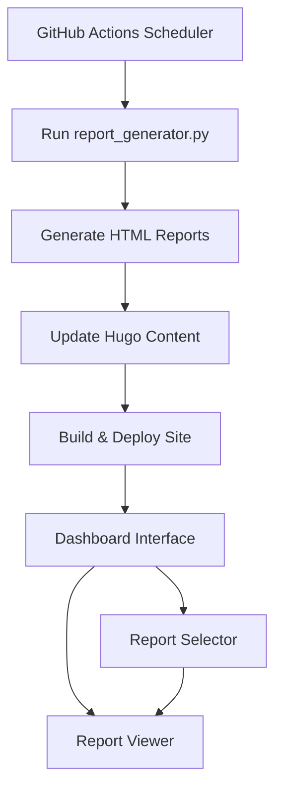
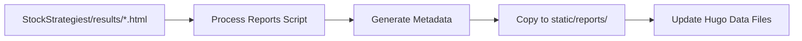

# Stock Analysis Dashboard Implementation Plan

## Overview

Create a dashboard-style interface for stock analysis reports with a report selector on the left and report viewer on the right, integrated with automated report generation and deployment.

## Architecture



## Phase 1: Hugo Dashboard Design

### 1.1 Dashboard Layout Structure

**Main Dashboard Page:** `content/StockReport/_index.md`
- Full-width dashboard layout
- Left sidebar: Report selector with search
- Right panel: Report viewer (iframe/embedded HTML)
- Responsive design for mobile devices

### 1.2 Hugo Templates & Layouts

**Files to Create:**
- `layouts/StockReport/list.html` - Main dashboard layout
- `layouts/shortcodes/stock-dashboard.html` - Dashboard component
- `layouts/partials/report-selector.html` - Left sidebar selector
- `layouts/partials/report-viewer.html` - Right panel viewer

### 1.3 Dashboard Features

**Report Selector (Left Panel):**
- Search box for filtering reports by stock symbol
- List of available reports with metadata
- Date stamps and generation status
- Quick filters (e.g., by strategy type)

**Report Viewer (Right Panel):**
- Iframe container for HTML reports
- Loading states and error handling
- Fullscreen toggle option
- Report navigation controls

## Phase 2: Data Processing & Integration

### 2.1 Report Processing Pipeline



**Processing Steps:**
1. Scan `StockStrategiest/results/` for HTML files
2. Extract metadata from HTML reports (title, date, stock symbol)
3. Generate `data/reports.json` for Hugo consumption
4. Copy HTML files to `static/reports/current/`

### 2.2 Hugo Data Structure

**File:** `data/reports.json`
```json
{
  "reports": [
    {
      "id": "PKO_2025-06-11",
      "symbol": "PKO",
      "title": "PKO Bank Polski S.A.",
      "date": "2025-06-11",
      "timestamp": "2025-06-11T14:29:04Z",
      "file": "PKO.html",
      "strategies": ["Trend + Momentum", "Volume Confirmation", "Bollinger + Oscillators"],
      "signals": {
        "buy": 0,
        "sell": 0,
        "hold": 1
      }
    }
  ],
  "lastUpdated": "2025-06-11T14:29:04Z"
}
```

## Phase 3: Frontend Implementation

### 3.1 Dashboard JavaScript

**File:** `static/js/stock-dashboard.js`

**Features:**
- Search functionality for report filtering
- Dynamic report loading in iframe
- URL state management (deep linking)
- Responsive sidebar toggle
- Loading states and error handling

### 3.2 Dashboard Styling

**File:** `static/css/stock-dashboard.css`

**Layout:**
- CSS Grid for dashboard layout
- Responsive breakpoints
- Dark/light theme support (matching site theme)
- Smooth transitions and animations

### 3.3 User Experience Features

- **Search & Filter:** Real-time search with debouncing
- **Report Loading:** Smooth transitions with loading indicators
- **Mobile Responsive:** Collapsible sidebar on mobile
- **Keyboard Navigation:** Arrow keys for report navigation
- **URL Sharing:** Shareable URLs for specific reports

## Phase 4: Automation & Deployment

### 4.1 GitHub Actions Workflow

**File:** `.github/workflows/daily-stock-reports.yml`

```yaml
name: Daily Stock Reports
on:
  schedule:
    - cron: '0 6 * * *'  # Daily at 6:00 UTC
  workflow_dispatch:     # Manual trigger

jobs:
  generate-reports:
    runs-on: ubuntu-latest
    steps:
      - name: Checkout main repo
        uses: actions/checkout@v4
        with:
          submodules: recursive
          token: ${{ secrets.GITHUB_TOKEN }}

      - name: Setup Python
        uses: actions/setup-python@v4
        with:
          python-version: '3.11'

      - name: Install dependencies
        run: |
          cd StockStrategiest
          pip install -r requirements.txt

      - name: Generate reports
        run: |
          cd StockStrategiest
          python report_generator.py

      - name: Process reports for Hugo
        run: |
          python scripts/process-reports.py

      - name: Commit changes
        run: |
          git config user.name 'github-actions[bot]'
          git config user.email 'github-actions[bot]@users.noreply.github.com'
          git add data/reports.json static/reports/
          git commit -m "Update stock reports - $(date)" || echo "No changes"
          git push

      - name: Build and Deploy Hugo
        uses: peaceiris/actions-hugo@v2
        with:
          hugo-version: 'latest'
          extended: true

      - name: Build site
        run: hugo --minify

      - name: Deploy to GitHub Pages
        uses: peaceiris/actions-gh-pages@v3
        with:
          github_token: ${{ secrets.GITHUB_TOKEN }}
          publish_dir: ./public
```

### 4.2 Report Processing Script

**File:** `scripts/process-reports.py`

**Functions:**
- Scan HTML files in `StockStrategiest/results/`
- Parse HTML for metadata extraction
- Generate `data/reports.json`
- Copy files to static directory
- Handle file cleanup and organization

## Phase 5: Implementation Steps

### Step 1: Create Dashboard Layout (Day 1)
1. Create main dashboard page structure
2. Implement basic Hugo templates
3. Add CSS grid layout for dashboard
4. Test responsive design

### Step 2: Build Report Selector (Day 1-2)
1. Create report selector partial
2. Implement search functionality
3. Add filtering capabilities
4. Style the sidebar component

### Step 3: Implement Report Viewer (Day 2)
1. Create iframe-based report viewer
2. Add loading states and error handling
3. Implement fullscreen toggle
4. Test with existing HTML reports

### Step 4: Data Processing (Day 2-3)
1. Create report processing script
2. Implement metadata extraction
3. Generate Hugo data files
4. Test with sample reports

### Step 5: GitHub Actions Setup (Day 3)
1. Create workflow configuration
2. Test automation pipeline
3. Configure deployment to GitHub Pages
4. Add error handling and notifications

### Step 6: Testing & Refinement (Day 3-4)
1. End-to-end testing of automation
2. UI/UX improvements
3. Performance optimization
4. Mobile responsiveness testing

## Technical Specifications

### Dependencies
- Hugo (latest extended version)
- Python 3.11+ (for report processing)
- Node.js (optional, for advanced JS processing)

### Browser Support
- Modern browsers (Chrome, Firefox, Safari, Edge)
- Mobile responsive design
- Progressive enhancement approach

### Performance Considerations
- Lazy loading for report iframes
- Efficient search implementation
- Minimal JavaScript footprint
- Optimized CSS delivery

## File Structure After Implementation

```
shuffzord.github.io/
├── .github/workflows/
│   └── daily-stock-reports.yml
├── content/StockReport/
│   └── _index.md
├── data/
│   └── reports.json
├── layouts/
│   ├── StockReport/
│   │   └── list.html
│   ├── shortcodes/
│   │   └── stock-dashboard.html
│   └── partials/
│       ├── report-selector.html
│       └── report-viewer.html
├── static/
│   ├── css/
│   │   └── stock-dashboard.css
│   ├── js/
│   │   └── stock-dashboard.js
│   └── reports/
│       └── current/
├── scripts/
│   └── process-reports.py
└── StockStrategiest/ (submodule)
```

## Success Metrics

1. **Automation:** Reports generated and deployed daily without manual intervention
2. **User Experience:** Intuitive dashboard with fast report loading
3. **Performance:** Page load times under 3 seconds
4. **Reliability:** 99%+ uptime for automated processes
5. **Responsiveness:** Fully functional on mobile devices

This plan provides a focused approach to creating a professional stock analysis dashboard with automated report generation and deployment.